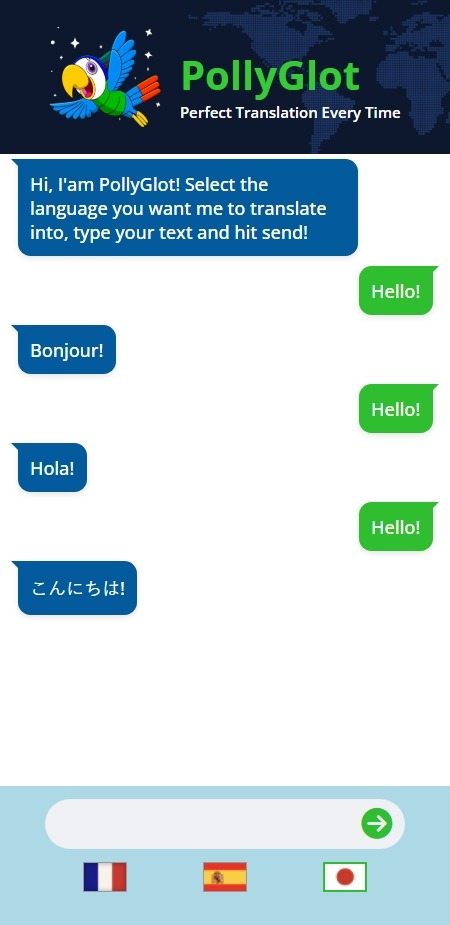

# PollyGlot

AI-powered chat app that translate messages into French, Spanish, or Japanese using the OpenAI GPT-3.5-turbo model. Built with HTML, CSS, and JS as one of the solo projects in the Scrimba AI Engineer Path course

[Try it here](https://polly-glot.pages.dev/)

<div style="margin: 0 auto;">
    
    
</div>

<!-- ## Getting Started
Install the dependencies and run the project
```
npm install
npm start
```

Head over to https://vitejs.dev/ to learn more about configuring vite
### About Scrimba

At Scrimba our goal is to create the best possible coding school at the cost of a gym membership! 💜
If we succeed with this, it will give anyone who wants to become a software developer a realistic shot at succeeding, regardless of where they live and the size of their wallets 🎉
The Frontend Developer Career Path aims to teach you everything you need to become a Junior Developer, or you could take a deep-dive with one of our advanced courses 🚀

- [Our courses](https://scrimba.com/allcourses)
- [The Frontend Career Path](https://scrimba.com/learn/frontend)
- [Become a Scrimba Pro member](https://scrimba.com/pricing)

Happy Coding!
-->
